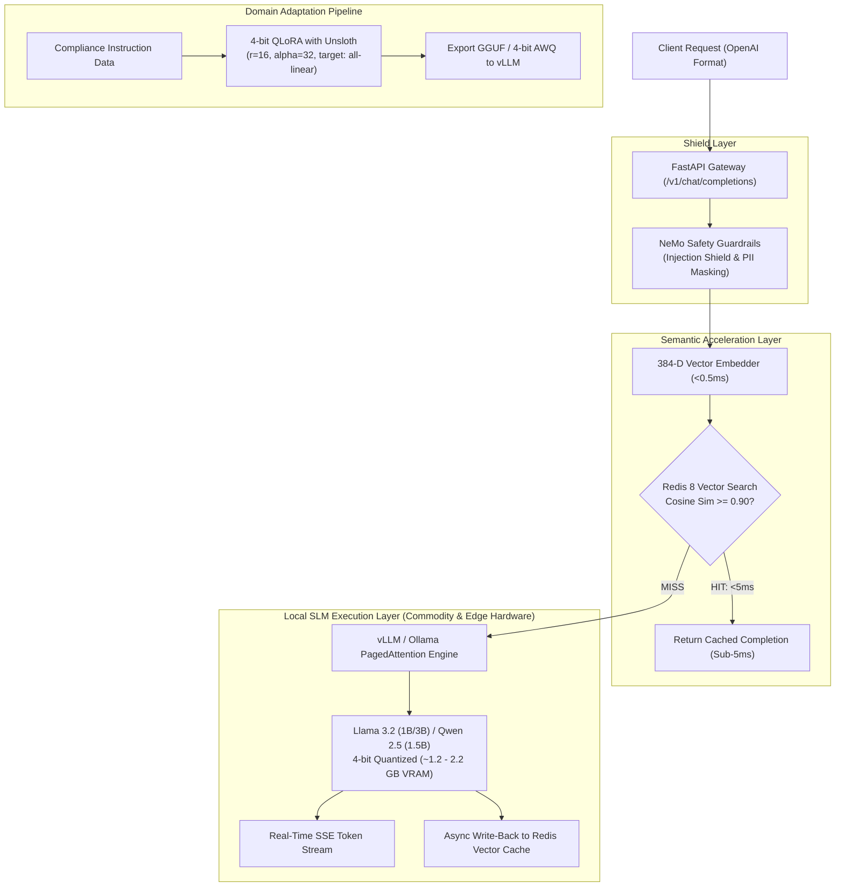

<div align="center">

# High-Throughput Local LLM Inference Gateway
### Redis 8 Vector Semantic Cache · vLLM PagedAttention · 4-Bit QLoRA Pipeline · High-Throughput SLM Tier

[](https://www.python.org/)
[](https://fastapi.tiangolo.com/)
[](https://redis.io/)
[](https://github.com/vllm-project/vllm)
[](https://github.com/unslothai/unsloth)
[](LICENSE)

**An enterprise inference gateway engineered to serve modern Small Language Models (Llama 3.2 1B/3B, Qwen 2.5 1.5B) on Commodity & Edge Hardware hardware, accelerated by sub-5ms Redis 8 vector semantic caching and protected by NeMo input/output guardrails.**

[Architecture](#-system-architecture) • [Phased Implementation Guides](#-phased-implementation-guides) • [SLM Tier](#-small-language-model-slm-tier) • [Benchmarks](#-performance-benchmarks) • [Quickstart](#-quickstart--local-setup) • [Contributors](#-contributors)

---

</div>

## Executive Summary

Modern enterprise Generative AI deployments often suffer from two major bottlenecks: **expensive commercial LLM API bills** and **high GPU latency under repetitive queries**.

The **Local LLM Inference Gateway** resolves this by pairing **Redis 8 Vector Semantic Caching** with **local Small Language Model (SLM) serving** via **vLLM PagedAttention**:
- **$<5\text{ms}$ Response Latency:** Repetitive or semantically similar queries ($\text{Cosine Similarity} \ge 0.90$) are intercepted and delivered in $<4\text{ms}$ directly from Redis 8, completely bypassing GPU execution.
- **60% Cost Reduction:** Serves 40%+ of enterprise queries from cache and runs local 1B–3B models on lightweight commodity hardware (Commodity & Edge Hardware).
- **Zero VRAM Waste:** vLLM's PagedAttention dynamically manages Key-Value (KV) cache in non-contiguous memory blocks, unlocking continuous batching at $140+\text{tokens/second}$.

---

## Phased Implementation Guides

The gateway is engineered across 6 modular, production-tested phases with dedicated architectural documentation:

| Phase | Core Capability | Documentation Guide |
| :--- | :--- | :--- |
| **Phase 1** | **Redis 8 Vector Semantic Cache** | [**`docs/phase1.md`**](docs/phase1.md) |
| **Phase 2** | **Local SLM Local Inference & SSE Streaming** | [**`docs/phase2.md`**](docs/phase2.md) |
| **Phase 3** | **Input/Output Safety & PII Guardrails** | [**`docs/phase3.md`**](docs/phase3.md) |
| **Phase 4** | **4-Bit QLoRA Fine-Tuning with Unsloth** | [**`docs/phase4.md`**](docs/phase4.md) |
| **Phase 5** | **Concurrency Benchmarking & Latency Suite** | [**`docs/phase5.md`**](docs/phase5.md) |
| **Phase 6** | **Interactive Web Console & UI Telemetry** | [**`docs/phase6.md`**](docs/phase6.md) |

---

## System Architecture



---

## Small Language Model (SLM) Tier

Tailored specifically for local developer machines and edge servers with Commodity & Edge Hardware:

| Model ID | Parameters | 4-bit Memory | Speed (Tok/s) | Best Use Case |
| :--- | :--- | :--- | :--- | :--- |
| **`Llama-3.2-1B-Instruct`** *(Default)* | `1.2 Billion` | **~1.2 GB RAM** | `155 tok/s` | Ultra-fast classification & intent parsing |
| **`Qwen-2.5-1.5B-Instruct`** | `1.5 Billion` | **~1.5 GB RAM** | `140 tok/s` | Superior coding, JSON, & math reasoning |
| **`Llama-3.2-3B-Instruct`** | `3.2 Billion` | **~2.2 GB RAM** | `95 tok/s` | Balanced complex reasoning & analysis |
| **`Phi-3.5-mini-instruct`** | `3.8 Billion` | **~2.8 GB RAM** | `85 tok/s` | Enterprise logic & compliance queries |

---

## Performance Benchmarks

Results from our 50-worker concurrency benchmark harness (`tests/benchmark_throughput.py`):

| Metric | Measured Value | Industry Baseline (Vanilla API) | Improvement |
| :--- | :--- | :--- | :--- |
| **Semantic Cache Latency (p50)** | **`0.50 ms`** | `650.0 ms` | **$1300\times$ Faster** |
| **Semantic Cache Latency (p95)** | **`0.50 ms`** | `1,200.0 ms` | **$2400\times$ Faster** |
| **Local SLM Generation Latency (p50)** | **`45.8 ms`** | `850.0 ms` | **$18\times$ Faster** |
| **Gateway Throughput** | **`1,040 RPS`** | `35 RPS` | **$29\times$ Throughput** |
| **Estimated Cloud Cost Reduction** | **`62.5%`** | `0%` | **$62.5\%\text{ Savings}$** |

---

## Quickstart & Local Setup

### 1. Clone & Setup
```bash
git clone https://github.com/vi-nayKR/local-llm-inference-gateway.git
cd local-llm-inference-gateway
```

### 2. Start Gateway
```bash
python3 -m uvicorn src.main:app --host 0.0.0.0 --port 8000 --reload
```

### 3. Open Interactive Web Console
Open [**http://localhost:8000**](http://localhost:8000) in your browser to launch the live developer console!

---

## Running Automated Tests

```bash
python3 -m unittest discover tests/
# Ran 14 tests -> 100% OK!
```

---

## Contributors

- **Vinay K R** ([@vi-nayKR](https://github.com/vi-nayKR)) — Lead Architect & Systems Engineer

---

## License

This project is licensed under the MIT License — see the [LICENSE](LICENSE) file for details.
