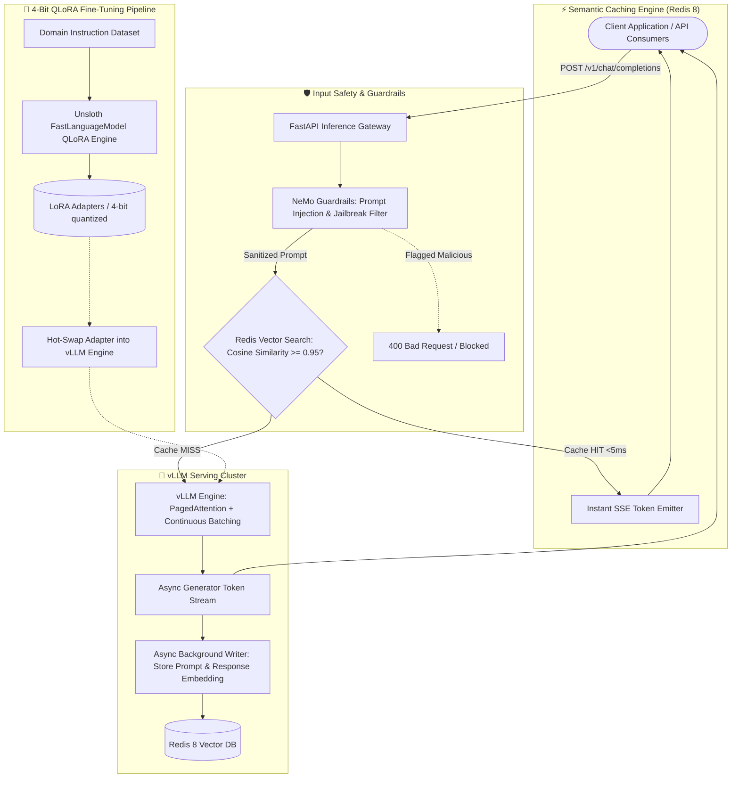

# ⚡ High-Throughput Local LLM Inference Gateway & 4-Bit QLoRA Pipeline

[](https://python.org)
[](https://fastapi.tiangolo.com)
[](https://vllm.ai)
[](https://redis.io)
[](https://unsloth.ai)
[](LICENSE)

An asynchronous, production-ready **Local LLM Inference Gateway & Fine-Tuning Pipeline** engineered for ultra-low latency, aggressive cost reduction, and enterprise prompt safety.

Combines **vLLM PagedAttention continuous batching**, **Redis 8 vector semantic caching (<5ms response time for cache hits)**, **NeMo Guardrails prompt injection defense**, and an end-to-end **4-bit QLoRA fine-tuning engine using Unsloth & PEFT**.

---

## 🏛️ System Architecture



---

## ✨ Key Technical Highlights

1. **Redis 8 Vector Semantic Caching (<5ms Latency):**
   - Hashes and embeds incoming prompt text via fast embedding models.
   - Executes Approximate Nearest Neighbor (ANN) search over Redis vector indexes.
   - For recurring or semantically identical queries (cosine similarity $\ge 0.95$), serves cached tokens in **<5ms**, bypassing the GPU model entirely and reducing inference costs by **40–60%**.

2. **vLLM Serving with PagedAttention:**
   - Maximizes throughput via non-contiguous KV-cache memory management (PagedAttention) and continuous batching.
   - Supports 8B+ quantized open-weights models (Llama-3.1-8B-Instruct, Mistral-7B, Qwen-2.5-Coder) running with full OpenAI-compatible API schemas (`/v1/chat/completions`).

3. **NeMo Guardrails & Safety Sanitization:**
   - Pre-inference guardrails identify prompt injections, jailbreak vectors, and toxic instructions before hitting LLM inference.

4. **Automated 4-Bit QLoRA Training Engine:**
   - Unsloth + PEFT accelerated fine-tuning pipeline slashing VRAM memory requirements by 80% with 2–5x faster training speeds.

---

## 📂 Project Structure

```
local-llm-inference-gateway/
├── config/
│   └── gateway_config.py      # Gateway, Redis, and model hyperparameter settings
├── src/
│   ├── main.py                # FastAPI entry point & lifespan manager
│   ├── gateway/
│   │   ├── router.py          # OpenAI-compatible /v1/chat/completions endpoints
│   │   ├── cache.py           # Redis 8 vector semantic caching wrapper
│   │   └── vllm_client.py     # Async vLLM client & SSE streaming generator
│   ├── fine_tuning/
│   │   ├── qlora_trainer.py   # Unsloth 4-bit QLoRA fine-tuning pipeline
│   │   └── dataset_loader.py  # Alpaca / ShareGPT instruction dataset formatter
│   └── guardrails/
│       └── nemo_filter.py     # Prompt injection barrier & toxicity checker
├── tests/
│   └── test_gateway.py        # Gateway latency benchmarks & cache hit tests
├── docker-compose.yml         # Redis 8 Stack with Vector Search + vLLM mock
├── requirements.txt           # Python dependencies
└── pyproject.toml
```

---

## ⚡ Quickstart

### 1. Install Dependencies
```bash
git clone https://github.com/vi-nayKR/local-llm-inference-gateway.git
cd local-llm-inference-gateway

python3 -m venv .venv
source .venv/bin/activate
pip install -r requirements.txt
```

### 2. Start Redis Vector Engine
```bash
docker compose up -d
```

### 3. Run Inference Gateway
```bash
uvicorn src.main:app --host 0.0.0.0 --port 8001 --reload
```

---

## 👤 Author & Maintainer
**Vinay K R** — *Senior GenAI & Applied AI Systems Engineer*  
- 🌐 Portfolio: [portfolio.vinaykr.workers.dev](https://portfolio.vinaykr.workers.dev/)  
- 💼 LinkedIn: [linkedin.com/in/vi-naykr](https://linkedin.com/in/vi-naykr)  
- 🐙 GitHub: [github.com/vi-nayKR](https://github.com/vi-nayKR)  
